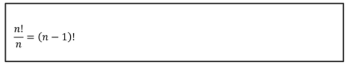

# 순열

**팩토리얼**
- 1에서 n까지 모든 자연수의 곱 (n!)
    - **`n! = n(n-1)(n-2) ‥ 1`**
    - 1! = 1
    - 2! = 1 x 2
    - 3! = 1 x 2 x 3
    - 0! = 1

```java
// 5! 
IntStream.range(2, 6).reduce(1, (x, y) -> (x * y))
```
----
**순열**
- 순서를 정해서 나열
- 서로 다른 n개 중에 r개를 선택하는 경우의 수
  - 순서가 존재한다.
  - 중복을 허용하지 않는다.
- 예) 5명을 3줄로 세우는 방법
- 예) 서로 다른 4명 중 반장, 부반장을 뽑는 방법


```java
int result = 1; 

for (int i = n; i >= n - r + 1; i--) {
    result *= i;
}
```
---
**중복순열**
- 서로 다른 n개 중에 r개를 선택하는 경우의 수
  - 순서가 존재한다.
  - 중복을 허용한다.
- 예) 서로 다른 4개의 수 중 2개를 뽑는 방법(중복을 허용한다.)
- 예) 후보 2명, 유권자 3명일 때 **`기명`** 투표 방법


```java
Math.pow(n, r)
```
---

**원순열**
- 원 모양의 테이블에 n개의 원소를 나열하는 경우의 수
- 회전시켰을 때 순서가 유지되는 경우 동일한 경우로 취급한다.
-  예) 원 모양의 테이블에 3명 (A,B,C)을 앉히는 경우
   -  3! = 6
   - (A, B, C), (B, C, A), (C, A, B) 는 동일한 케이스로 취급한다. 



```java
result = 1;

for (int i = 1; i < n; i++) {
    result *= i;
}
```

---

**참고자료**

- [1, 2, 3, 4를 이용하여 세자리 자연수를 만드는 코드 (순서 O, 중복 X)
 ](https://github.com/ithingv34/cs-playground/blob/main/code/Math/src/Permutation.java)
 - [Swap을 이용한 순열 / Visited 배열을 이용한 순열](https://bcp0109.tistory.com/14)
 - [[알고리즘] 백트래킹, 순열, 조합, 부분집합, 중복순열]()